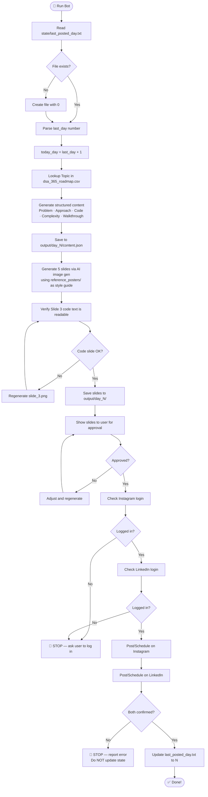

<div align="center">


<br/>


<br/><br/>

> **A zero-cost, fully automated pipeline that generates and posts a 5-slide DSA-in-Python carousel to Instagram & LinkedIn every single day — for 364 days straight.**

<br/>

</div>

---

## 📖 Table of Contents

- [✨ Overview](#-overview)
- [🗂️ Project Structure](#️-project-structure)
- [⚙️ How It Works — The Full Pipeline](#️-how-it-works--the-full-pipeline)
- [🧠 Content Generation Strategy](#-content-generation-strategy)
- [🎨 Image Generation Strategy](#-image-generation-strategy)
- [🤖 Browser Automation Strategy](#-browser-automation-strategy)
- [📅 Scheduling Strategy](#-scheduling-strategy)
- [🔢 State Management](#-state-management)
- [🐍 Key Functions & Scripts](#-key-functions--scripts)
- [📋 The 364-Day Roadmap](#-the-364-day-roadmap)
- [🚀 Getting Started](#-getting-started)
- [🛡️ Constraints & Design Decisions](#️-constraints--design-decisions)
- [🗺️ Roadmap](#️-roadmap)

---

## ✨ Overview

The **DSA Carousel Bot** is a personal automation system that eliminates the daily grind of content creation for coding education. Every day, it:

1. 📚 **Reads** today's DSA topic from a 364-day structured roadmap
2. 🧮 **Generates** educational content (problem, approach, code, complexity, walkthrough)
3. 🖼️ **Creates** 5 beautifully styled carousel slides using AI image generation
4. 📲 **Posts** the carousel to both Instagram and LinkedIn automatically via browser automation
5. 💾 **Tracks** state so no day is ever double-posted or skipped

**Zero paid APIs. Zero hosting. Zero tokens. 100% free.**

---

## 🗂️ Project Structure

```
dsa-carousel-bot/
│
├── 📄 dsa_365_roadmap.csv          # The master 364-day topic roadmap
├── 📄 .gitignore                    # Excludes output images & local state
├── 📄 README.md                     # You are here
│
├── 📁 src/
│   └── 🐍 generate_content.py       # State reader + topic extractor
│
├── 📁 reference_posters/            # Style reference images for AI generation
│   ├── download (4).jpg
│   ├── download (5).jpg
│   └── are you bored yet_ Wallows x Clairo.jpg
│
├── 📁 output/                       # Generated slides (gitignored)
│   ├── day_1/
│   │   ├── content.json             # Structured content for Day 1
│   │   ├── slide_1.png              # Title slide
│   │   ├── slide_2.png              # Approach slide
│   │   ├── slide_3.png              # Code slide
│   │   ├── slide_4.png              # Complexity slide
│   │   └── slide_5.png              # Walkthrough slide
│   └── day_N/
│       └── ...
│
└── 📁 state/                        # Local state tracking (gitignored)
    └── last_posted_day.txt          # Stores the last successfully posted day
```

---

## ⚙️ How It Works — The Full Pipeline



---

## 🧠 Content Generation Strategy

For each day's topic, the bot generates structured educational content across **5 dimensions**:

| Slide | Content | Purpose |
|-------|---------|---------|
| **Slide 1** — Title | Day number · Topic · Problem statement (1-2 lines) | Hook the viewer |
| **Slide 2** — Approach | 4–5 bullet points explaining the strategy | Teach the thinking |
| **Slide 3** — Code | Clean, working Python solution | Show the implementation |
| **Slide 4** — Complexity | Time & Space Big-O + reasoning | Deepen understanding |
| **Slide 5** — Walkthrough | Step-by-step trace with a concrete example | Cement learning |

### Content Quality Rules
- ✅ Code must be **correct and runnable** Python
- ✅ Complexity analysis must include **the reasoning**, not just the notation
- ✅ Walkthrough must trace **actual variable values** step by step
- ✅ All content is generated **fresh per day** — no copy-paste across days

---

## 🎨 Image Generation Strategy

Slides are generated using **AI image generation** with reference poster images as style anchors.

### Style Anchors
Up to 3 images from `reference_posters/` are passed to every image generation call to ensure visual consistency across all 364 days.

### Slide Design System
```
Background:     Light cream grid paper (retro-brutalist aesthetic)
Card:           White rectangle with thin black border + drop shadow
Day badge:      Small red sticker top-left reading "Day N"
Headings:       Bold black serif typography
Body text:      Clean sans-serif font
Code blocks:    Dark grey editor box with syntax highlighting
Accents:        Red (#E63946) + Black + White
Collage items:  Silver star elements, Python logo motif
Resolution:     1080×1080 px (1:1 — optimal for IG + LinkedIn)
```

### Code Slide Verification Protocol
> ⚠️ Image models can hallucinate or distort text/code. The pipeline includes a mandatory **visual inspection step** for Slide 3 before posting. If the code is distorted or incorrect, the slide is **regenerated automatically** — never posted as-is.

---

## 🤖 Browser Automation Strategy

Posting uses **no APIs, no tokens, no webhooks** — only browser automation against the actual web UIs, with the user already logged in.

### Platform Strategies

#### Instagram
| Method | Tool |
|--------|------|
| **Direct post (immediate)** | Native Instagram web creator (`instagram.com/create`) |
| **Scheduled post** | Meta Business Suite (`business.facebook.com`) — more reliable scheduler |

**Instagram Flow:**
1. Click `Create` → `Post` in sidebar
2. Upload `slide_1.png` via file picker
3. Click `Select multiple` icon → add slides 2–5
4. Click `Next` × 2 (Crop → Filters)
5. Enter caption in text area
6. For scheduling: `Advanced settings` → `Schedule this post` → set date/time → `Schedule`

#### LinkedIn
| Method | Approach |
|--------|----------|
| **Scheduled post** | Native LinkedIn composer with clock/schedule icon |

**LinkedIn Flow:**
1. Click `Start a post`
2. Click media/photo icon → upload 5 slides
3. Click `Next` on media editor
4. Enter caption in composer body
5. Click clock icon (`Schedule for later`) → set date/time → `Schedule`

### Login Safety Rules
```
❌ Never attempt to log in
❌ Never enter credentials
❌ Never guess UI selectors blindly
✅ Check login state first — stop immediately if not logged in
✅ Report exact error if posting fails
✅ NEVER update state if posting fails
```

---

## 📅 Scheduling Strategy

Posts can be handled in two modes:

| Mode | When to Use | How |
|------|-------------|-----|
| **Immediate Post** | When running the bot same-day | Upload → Caption → Share |
| **Scheduled Post** | When preparing content in advance | Upload → Caption → Schedule for date/time |

### Caption Template
```
Day {N}/364 🐍 #DSAwithPython

{Topic}

Swipe for approach → code → complexity → example 👉

#DSA #Python #CodingChallenge #100DaysOfCode #Programming
```

> **Note:** Browser automation strips unsupported emoji characters (e.g. `🐍`) when typing via keyboard simulation — the caption is posted with ASCII-safe alternatives automatically.

---

## 🔢 State Management

State is tracked with a single plain-text file:

```
state/last_posted_day.txt
```

| Value | Meaning |
|-------|---------|
| `0` | No days posted yet (initial state) |
| `N` | Day N was the last successfully posted day |

### State Update Rules
```python
# ONLY update AFTER both platforms confirm the post is live
# NEVER update if posting fails on either platform
# This guarantees: no skipped days, no double-posts on retry
```

The file is listed in `.gitignore` — it is **machine-local** and never committed to the repo.

---

## 🐍 Key Functions & Scripts

### `src/generate_content.py`

```python
def get_next_day_and_topic(csv_path, state_path):
    """
    Reads the state file to determine the last posted day,
    computes today's day number (last + 1),
    and looks up the corresponding topic in the CSV roadmap.

    Returns: (day: int, topic: str)

    Side effects:
    - Creates state/last_posted_day.txt with value 0 if it doesn't exist
    - Exits with error if CSV not found or day not in roadmap
    """
```

**Usage:**
```bash
python src/generate_content.py
# Output:
# DAY:1
# TOPIC:Time & Space Complexity Intro
```

### Image Generation Pipeline (Agent Tool)

Each slide is generated with a structured prompt following this pattern:
```
[Base style description from reference posters]
+ [Day badge specification]
+ [Slide-specific content layout]
+ [Typography and color rules]
+ [Resolution: 1080x1080]
```

Generated images are saved to the artifact directory then copied to `output/day_N/slide_K.png`.

---

## 📋 The 364-Day Roadmap

The roadmap (`dsa_365_roadmap.csv`) covers **10 phases** of DSA mastery:

| Phase | Topics Covered | Days |
|-------|---------------|------|
| 🔢 **Basics & Math** | Complexity, Big-O, Recursion, Bit Manipulation | 1–14 |
| 📊 **Arrays & Sorting** | Traversal, Two Pointers, Sorting algorithms | 15–49 |
| 🔗 **Linked Lists** | Singly, Doubly, Circular, Fast-Slow pointers | 50–70 |
| 📚 **Stacks & Queues** | Monotonic stack, Deque, LRU Cache | 71–91 |
| 🌲 **Trees** | BST, AVL, Heaps, Tries | 92–133 |
| 🕸️ **Graphs** | BFS, DFS, Dijkstra, Topological Sort | 134–175 |
| 🔍 **Searching** | Binary Search, Ternary Search | 176–196 |
| 💡 **Dynamic Programming** | Memoization, Tabulation, Knapsack, LCS | 197–259 |
| 🧩 **Advanced Topics** | Segment Trees, Fenwick, Disjoint Sets | 260–315 |
| 🏆 **Interview Prep** | System Design, Mock Interviews, Revision | 316–364 |

---

## 🚀 Getting Started

### Prerequisites
- Python 3.8+
- Antigravity IDE (for AI image generation + browser subagent)
- Instagram account (logged in via browser or Meta Business Suite)
- LinkedIn account (logged in via browser)

### Setup
```bash
# 1. Clone the repository
git clone https://github.com/legendxdevil/antigravity-automation.git
cd antigravity-automation

# 2. (Optional) Create virtual environment
python -m venv venv
venv\Scripts\activate   # Windows

# 3. Add your style reference images
# Drop 1-3 poster images into reference_posters/

# 4. Check what day you're on
python src/generate_content.py
```

### Running a Day
The bot is driven interactively through the Antigravity agent. Each daily run follows this sequence:

```
1. Agent reads state → determines Day N
2. Agent generates content for the topic
3. Agent generates 5 slides using reference_posters/ as style guide
4. You review and approve the slides
5. Agent checks login → posts to Instagram + LinkedIn
6. Agent updates state/last_posted_day.txt → N
```

---

## 🛡️ Constraints & Design Decisions

| Constraint | Reason |
|-----------|--------|
| **No paid APIs** | Keeps the system free forever — only free browser UIs |
| **No credentials in code** | Security — login is always done manually by the user |
| **No batch posting** | One day per run — prevents accidental spam |
| **State file is gitignored** | Machine-local; different machines may have different states |
| **Output images are gitignored** | Large binary files — don't belong in version control |
| **Reference posters are committed** | Small JPEGs, needed for consistent style generation |
| **Code slide verification** | AI image models can hallucinate text — always verify before posting |
| **Stop on login failure** | Never proceed without confirming the session is valid |

---

## 🗺️ Roadmap

- [x] Core pipeline (state → content → images → post)
- [x] Reference poster style anchoring
- [x] Instagram posting (immediate)
- [x] LinkedIn posting (immediate)
- [x] LinkedIn scheduling
- [x] Instagram scheduling via Meta Business Suite
- [ ] Automatic daily trigger via Windows Task Scheduler
- [ ] Watermark / branding overlay on all slides
- [ ] Analytics tracking (reach, saves, shares per day)
- [ ] Telegram notification on successful post
- [ ] Retry logic for failed posts with exponential backoff

---

<div align="center">

**Built with ❤️ using [Antigravity IDE](https://antigravity.dev) · Powered by AI**

<br/>

*364 days. 364 topics. 1 Python developer getting better every day.*

<br/>

⭐ **Star this repo if it inspired you!** ⭐

</div>
